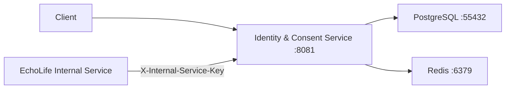

# EchoLife Identity & Consent Service

Backend microservice for the EchoLife platform responsible for identity, authentication, MFA, consent management, JWT security, authentication sessions, and session-access policy checks.

## Overview

The service provides:

- User registration and login
- JWT-based authentication
- MFA using TOTP
- BCrypt password hashing
- MFA-secret encryption using AES-GCM
- Redis-based login/MFA rate limiting
- Authentication-session management and revocation
- Persona consent management
- Internal session-access validation
- PostgreSQL persistence
- Health and metrics through Spring Boot Actuator

## Architecture



### Main Components

| Component | Responsibility |
|---|---|
| AuthController | Registration, login, logout and user APIs |
| MfaController | MFA enrollment, confirmation and disablement |
| ConsentController | Persona consent management |
| GovernanceController | Internal session-access checks |
| AuthService | Authentication and MFA logic |
| JwtService | JWT creation |
| AuthSessionService | Session creation/revocation |
| SessionAccessService | Age, consent and session policy checks |

## Technology Stack

| Technology | Purpose |
|---|---|
| Java 21 | Backend language |
| Spring Boot 4.1.1 | Backend framework |
| Spring Security | Authentication/security |
| Spring Data JPA / Hibernate | Persistence |
| PostgreSQL | Database |
| Redis | Rate limiting and MFA protection |
| Flyway | Database migrations |
| Maven | Build tool |
| Docker Compose | Local infrastructure |

## Prerequisites

- Java 21
- Maven
- Docker Desktop with Docker Compose

PostgreSQL and Redis can be started using the included Compose configuration.

## Project Structure

```text
identity-consent-service/
├── src/main/java/com/echolife/identity/
│   ├── controller/
│   ├── dto/
│   ├── entity/
│   ├── repository/
│   ├── security/
│   └── service/
├── src/main/resources/
│   ├── db/migration/
│   └── application.yml
├── keys/
├── docker-compose.yml
├── .env.example
├── .gitignore
├── pom.xml
└── README.md
```

## Environment Configuration

Create `.env` from `.env.example`:

```powershell
Copy-Item .env.example .env
```

Important configuration includes:

| Variable | Purpose |
|---|---|
| `DB_URL` | PostgreSQL connection |
| `DB_USERNAME` | Database user |
| `DB_PASSWORD` | Database password |
| `POSTGRES_PASSWORD` | PostgreSQL container password |
| `ECHOLIFE_PRIVATE_KEY_PATH` | JWT private key |
| `ECHOLIFE_PUBLIC_KEY_PATH` | JWT public key |
| `ECHO_MFA_ENCRYPTION_KEY` | AES encryption key |
| `ECHOLIFE_INTERNAL_SERVICE_KEY` | Internal API authentication |
| `ECHOLIFE_JWT_ISSUER` | JWT issuer |
| `ECHOLIFE_CORS_ALLOWED_ORIGINS` | Allowed frontend origins |
| `SERVER_PORT` | Application port |
| `ECHOLIFE_ACCESS_TOKEN_TTL_SECONDS` | Access-token lifetime |
| `ECHOLIFE_MFA_CHALLENGE_TTL_SECONDS` | MFA challenge lifetime |
| `ECHO_MIN_SESSION_AGE` | Minimum session age |

**Never commit `.env`, private keys, passwords, or encryption keys.**

## Database & Docker Setup

The included Compose configuration provides:

- PostgreSQL database: `echolife_identity`
- PostgreSQL host port: `55432`
- Redis host port: `6379`

Start dependencies:

```bash
docker compose up -d
```

Check status:

```bash
docker compose ps
```

View logs:

```bash
docker compose logs -f
```

Stop containers:

```bash
docker compose down
```

Flyway migrations run automatically when the application starts.

Migration files are located in:

```text
src/main/resources/db/migration/
```

## Local Backend Setup

1. Create `.env`.
2. Configure RSA keys and required secrets.
3. Start PostgreSQL and Redis:

```bash
docker compose up -d
```

4. Build:

```bash
mvn clean install
```

5. Run:

```bash
mvn spring-boot:run
```

The service runs on:

```text
http://localhost:8081
```

## API Endpoints

### Authentication

| Method | Endpoint | Authentication |
|---|---|---|
| POST | `/api/v1/auth/register` | Public |
| POST | `/api/v1/auth/login` | Public |
| POST | `/api/v1/auth/mfa/verify` | Public |
| GET | `/api/v1/auth/me` | JWT |
| POST | `/api/v1/auth/logout` | JWT |
| POST | `/api/v1/auth/logout-all` | JWT |

### MFA

| Method | Endpoint | Authentication |
|---|---|---|
| POST | `/api/v1/auth/mfa/enroll` | JWT |
| POST | `/api/v1/auth/mfa/confirm` | JWT |
| POST | `/api/v1/auth/mfa/disable` | JWT |

### Consent

| Method | Endpoint | Authentication |
|---|---|---|
| POST | `/api/v1/consents` | JWT |

### Internal API

| Method | Endpoint | Authentication |
|---|---|---|
| POST | `/api/v1/internal/session-access-check` | Internal service key |

Internal requests require:

```text
X-Internal-Service-Key: <YOUR_INTERNAL_SERVICE_KEY>
```

## Authentication & Security

- Passwords use BCrypt hashing.
- JWTs use RSA/RS256.
- Access tokens contain user/session information and have a default 900-second lifetime.
- MFA uses TOTP.
- MFA secrets are encrypted using AES-GCM.
- Redis protects login and MFA attempts.
- Authentication sessions can be revoked.
- Protected APIs require JWT authentication.
- Internal APIs use `X-Internal-Service-Key`.

## Verify the Application

Health check:

```bash
curl http://localhost:8081/actuator/health
```

Readiness:

```bash
curl http://localhost:8081/actuator/health/readiness
```

## Testing

Run:

```bash
mvn test
```

The uploaded project currently does not contain a `src/test` test suite.

## Common Troubleshooting

### PostgreSQL connection failure

Check:

```bash
docker compose ps
```

Verify `DB_URL`, `DB_USERNAME`, and `DB_PASSWORD`.

### Port 8081 already in use

Use another port:

```text
SERVER_PORT=8082
```

### RSA key error

Verify:

```text
ECHOLIFE_PRIVATE_KEY_PATH
ECHOLIFE_PUBLIC_KEY_PATH
```

and ensure both files exist.

### MFA encryption key error

`ECHO_MFA_ENCRYPTION_KEY` must be valid Base64 and decode to exactly 32 bytes.

### Redis connection failure

Start Redis:

```bash
docker compose up -d redis
```

### JWT validation failure

Check the RSA public key, JWT issuer, token expiry, audience, and session status.

## Known Setup Issues

- `.env` and RSA key files are present in the uploaded project and must not be committed.
- `application.yml` contains a database-password fallback that should be replaced with secure environment-based configuration.
- RSA keys must be provided before startup.
- No automated test classes are currently included.
- `.env.example` contains some settings belonging to other EchoLife components; configure them only when required.

## Production Considerations

Before production deployment:

- Use a secure secret manager.
- Never commit private keys or secrets.
- Use HTTPS.
- Restrict CORS.
- Use production PostgreSQL and Redis infrastructure.
- Configure JWT key rotation.
- Protect internal service authentication.
- Enable appropriate logging and monitoring.
- Review Actuator exposure and security.

## Quick Start

```powershell
Copy-Item .env.example .env
```

Configure the required secrets and RSA keys, then:

```bash
docker compose up -d
mvn clean install
mvn spring-boot:run
```

Verify:

```bash
curl http://localhost:8081/actuator/health
```
